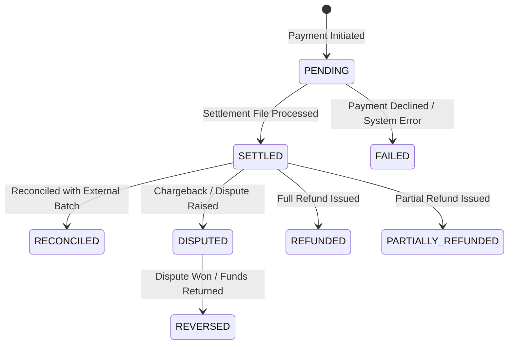

# Domain Model & Financial Invariants Specification

## 1. Action Classification & Safety Boundaries

Agents operate through APIs classified strictly by action risk level:

| Action Risk Classification | Permitted Tools | Behavior & Authorization Boundary |
| :--- | :--- | :--- |
| `READ_ONLY` | `READ_TRANSACTION`, `SEARCH_TRANSACTION`, `GET_SETTLEMENT_FILE` | Safe inspection. No state mutation. |
| `LOW_RISK_WRITE` | `RECONCILE`, `CREATE_EXCEPTION`, `RETRY_TOOL` | Standard operational state recording. Auditable. |
| `HIGH_RISK_WRITE` | `EXECUTE_REFUND`, `APPROVE_SETTLEMENT`, `REJECT_SETTLEMENT` | Financial payout state mutation. Requires valid authorization token / supervisory credential. |
| `HUMAN_APPROVAL_REQUIRED` | `REQUEST_APPROVAL`, `ESCALATE_TO_HUMAN` | Passes control to human supervisor when risk threshold or ambiguity is reached. |

---

## 2. Centralized Financial Invariant Enforcement (`FinancialInvariantValidator`)

To ensure deterministic financial safety, all domain mutations must be validated by a single centralized `FinancialInvariantValidator` before committing state:

```
[REST Controller / API Layer]
         │
         ▼
[Service Layer] ──► [FinancialInvariantValidator]
         │                    │
         │ (If Valid)         ├─► Validate BigDecimal Precision (Scale 2, positive)
         ▼                    ├─► Verify Conservation of Balance (Gross - Fee = Net)
[PostgreSQL Database]          ├─► Check Refund Cap (Cumulative Refund <= Original Amount)
                              ├─► Check Idempotency Key Uniqueness
                              └─► Reject Unauthorized Action Attempts
```

### Invariant Rules Enforced:
1. **Monetary Precision & Type Invariant**: All monetary values MUST use `java.math.BigDecimal` (scale 2, `ROUND_HALF_UP`). Floating-point types (`float`, `double`) are strictly prohibited.
2. **Conservation of Balance**: $\text{Gross Amount} - \text{Fee Amount} = \text{Net Settlement Amount}$.
3. **Refund Cap Invariant**: For any payment $P$, $\sum \text{Refund Amounts} \le P.\text{amount}$. Refunds exceeding original payment require explicit exception handling.
4. **Idempotency Invariant**: All write operations require a unique `idempotency_key`. Re-submitting an identical key returns the cached prior response without duplicating financial state changes.
5. **Double Settlement Prevention**: A payment transaction in state `RECONCILED` cannot be matched to a second settlement line item.
6. **Immutable Audit Trail**: An `AuditEvent` must be recorded for every action attempt (both success and failure). Audit entries are append-only and cryptographically chained via SHA-256.

---

## 3. Explicit Financial State Machines

Entities undergo strict state transitions managed by domain validators:



---

## 4. Database Schema Entities & Technical Safeguards

- **Optimistic Locking**: Core entities (`Transaction`, `SettlementBatch`, `ReconciliationRecord`) use `@Version` fields to prevent concurrent state overwrites.
- **Database Constraints**: SQL check constraints (`amount > 0`, foreign key integrity, unique idempotency keys) enforce safeguards at the PostgreSQL layer.

### Key Fields:
- **Transaction**: `id` (UUID), `idempotency_key` (String, Unique), `amount` (`BigDecimal`), `currency` (USD), `status` (Enum), `version` (Long).
- **SettlementBatch**: `id` (UUID), `merchant_id` (UUID), `gross_amount` (`BigDecimal`), `fee_amount` (`BigDecimal`), `net_amount` (`BigDecimal`), `status` (Enum), `version` (Long).
- **ReconciliationRecord**: `id` (UUID), `transaction_id` (String), `settlement_line_item_id` (UUID), `discrepancy_amount` (`BigDecimal`), `match_status` (Enum).
- **AuditEvent**: `id` (UUID), `run_id` (UUID), `scenario_id` (String), `actor` (String), `tool_used` (String), `risk_level` (Enum), `input_hash` (String), `authz_decision` (Enum), `result` (Enum), `prev_hash` (String), `current_hash` (String), `timestamp` (Instant).
